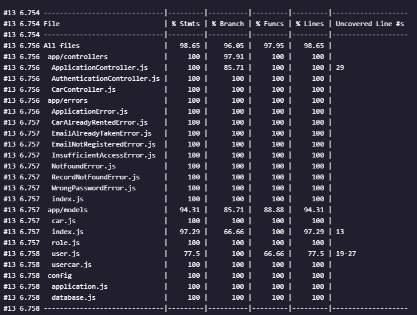
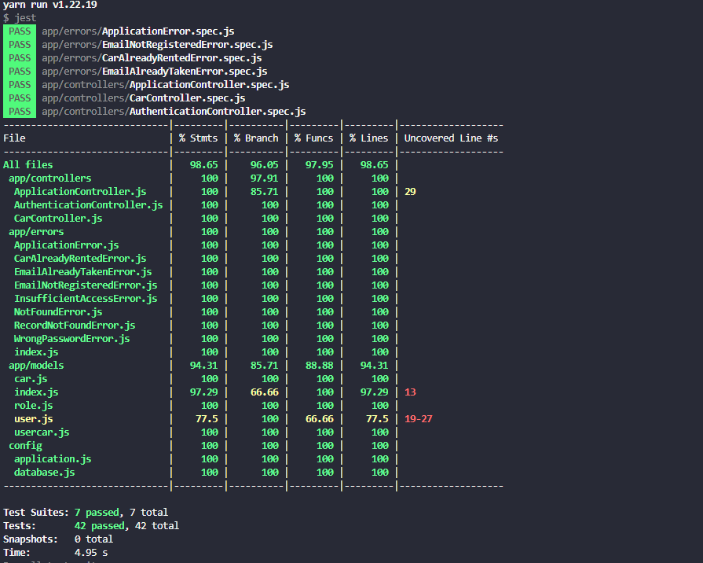

# BCR API

Di dalam repository ini terdapat implementasi API dari Binar Car Rental.
Tugas kalian disini adalah:
1. Fork repository
2. Tulis unit test di dalam repository ini menggunakan `jest`.
3. Coverage minimal 70%

Good luck!

## How to Run This Project

1. Clone the repo and link railway
    ```sh
    git clone https://github.com/riowidywasa/BINAR_FSW-3_Challenge-08

    railway https://binarfsw-3challenge-8-production.up.railway.app/
    ```
2. Install packages
    ```sh
    yarn install
    ```
3. Next Step

    ```sh
    - setting file config/database.js or you can create a .env file
    - run command : npm run db:setup || yarn db:setup
    ```

4. Run

    ```sh
    yarn develop
    ```

## Test Result

This project was tested using jest and supertest. This project also using EsLint as the code linter.




